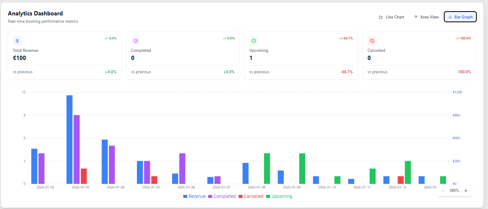
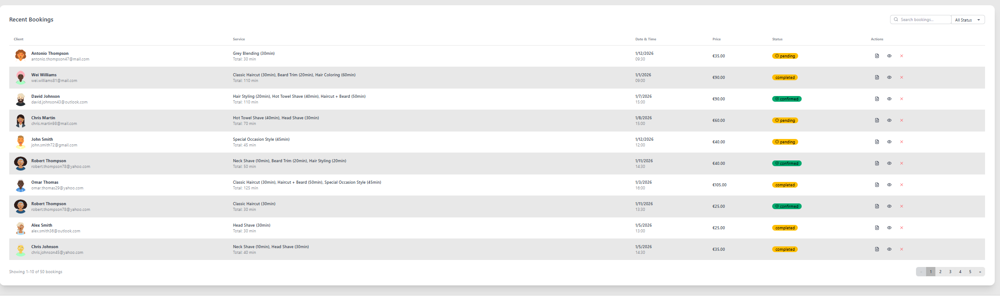
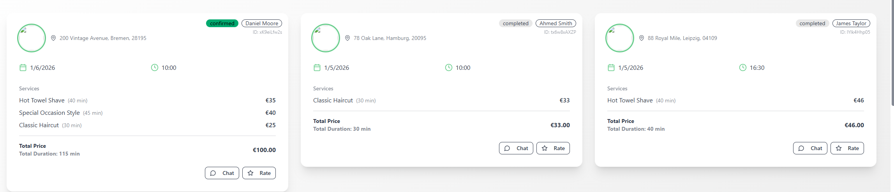
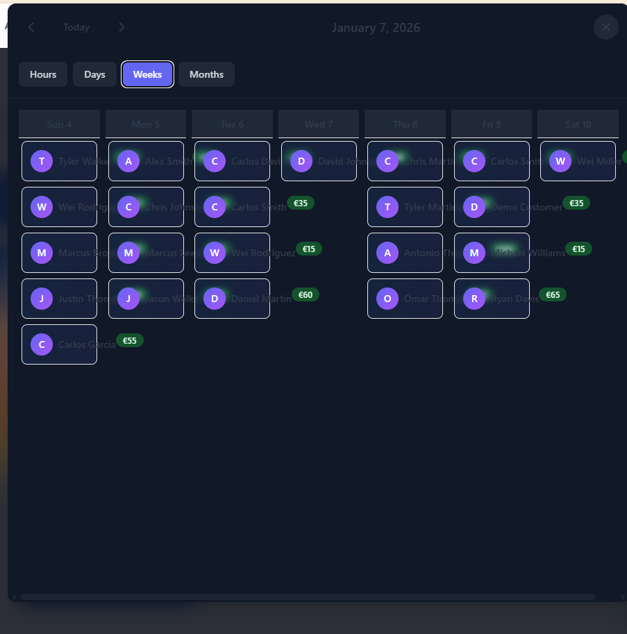
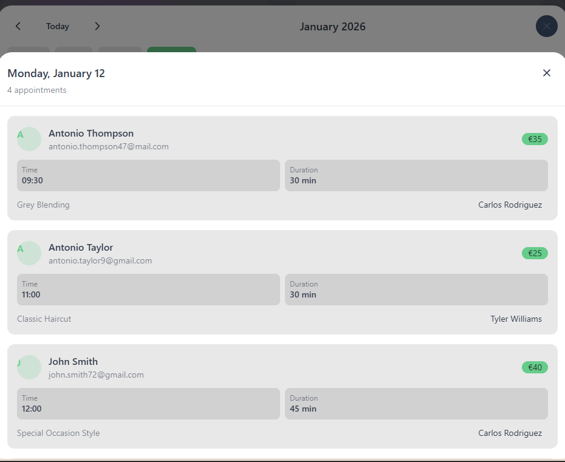
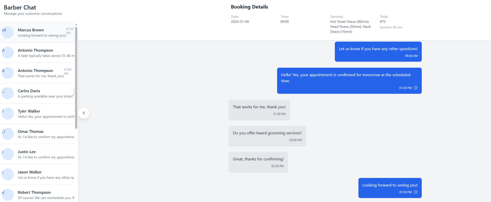
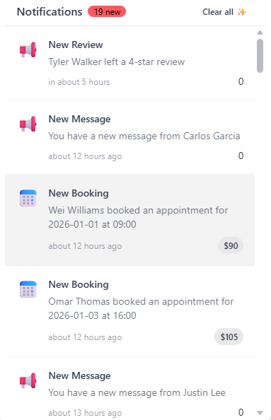
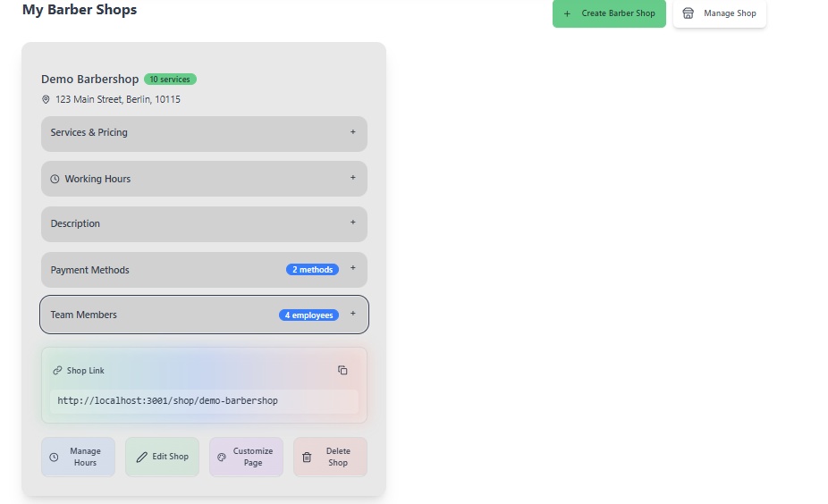
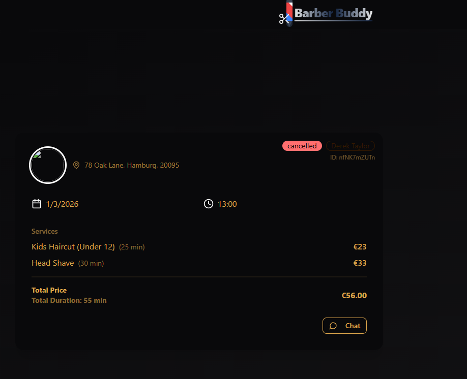

<div align="center">

# ✂️ BarbersBuddies

### The Complete Open-Source Booking Platform for Barbershops

**Launch your own professional barbershop booking system in minutes. Free, open-source, and packed with features.**

[](https://github.com/Khanto87/BarbersBuddies/releases)
[](https://reactjs.org/)
[](https://firebase.google.com/)
[](https://stripe.com/)
[](LICENSE)

[Live Demo](https://barbersbuddies.com) · [Report Bug](https://github.com/Khanto87/BarbersBuddies/issues) · [Request Feature](https://github.com/Khanto87/BarbersBuddies/issues)

</div>

---

## 📸 Screenshots

<div align="center">

### Shop Owner Dashboard

<p><i>Real-time analytics with revenue tracking, booking stats, and performance metrics</i></p>

### Booking Management
<table>
<tr>
<td align="center"><br/><b>Bookings Table</b></td>
</tr>
<tr>
<td align="center"><br/><b>Booking Cards View</b></td>
</tr>
</table>

### Calendar & Scheduling
<table>
<tr>
<td align="center"><br/><b>Month View</b></td>
<td align="center"><br/><b>Week View (Dark)</b></td>
</tr>
</table>


<p><i>Detailed day view with appointment breakdown</i></p>

### Messaging & Communication
<table>
<tr>
<td align="center"><br/><b>Customer Messaging</b></td>
</tr>
<tr>
<td align="center"><br/><b>Notifications Panel</b></td>
</tr>
</table>

### Shop Management

<p><i>Manage services, employees, hours, and shop settings</i></p>

### Dark Mode

<p><i>Full dark mode support across the entire platform</i></p>

</div>

---

## ⚡ Features

| Feature | Description |
|---------|-------------|
| 🗓️ **Smart Booking** | Real-time availability, service selection, employee assignment |
| 📊 **Analytics Dashboard** | Track revenue, bookings, and customer trends |
| 💳 **Stripe Payments** | Secure payment processing built-in |
| 🌍 **Multi-language** | English, German, Turkish, Arabic |
| 🎨 **Themes** | Light, dark, and luxury themes |
| 📱 **Mobile-first** | Fully responsive design |
| 🔔 **Notifications** | Email confirmations + in-app alerts |
| 👥 **Employee Management** | Staff schedules, assignments, permissions |
| ⭐ **Ratings & Reviews** | Customer feedback system |
| 💬 **Messaging** | Shop-to-customer communication |
| 📅 **Calendar Views** | Hours, days, weeks, months view |
| 🔐 **Demo Mode** | Built-in demo accounts for testing |

---

## 🏗️ Architecture

```
┌─────────────────────────────────────────────────────────────────┐
│                         Client (React)                          │
│  ┌──────────┐ ┌──────────┐ ┌──────────┐ ┌──────────────────┐   │
│  │ Booking  │ │Dashboard │ │  Shop    │ │   Auth & User    │   │
│  │   Flow   │ │ Analytics│ │ Landing  │ │   Management     │   │
│  └────┬─────┘ └────┬─────┘ └────┬─────┘ └────────┬─────────┘   │
└───────┼────────────┼────────────┼────────────────┼─────────────┘
        │            │            │                │
        ▼            ▼            ▼                ▼
┌─────────────────────────────────────────────────────────────────┐
│                      Firebase Services                          │
│  ┌──────────┐ ┌──────────┐ ┌──────────┐ ┌──────────────────┐   │
│  │Firestore │ │   Auth   │ │ Storage  │ │    Functions     │   │
│  │    DB    │ │          │ │ (Images) │ │  (Email/Stripe)  │   │
│  └──────────┘ └──────────┘ └──────────┘ └──────────────────┘   │
└─────────────────────────────────────────────────────────────────┘
        │                                          │
        ▼                                          ▼
   ┌─────────┐                              ┌─────────────┐
   │ Stripe  │                              │   Mailgun   │
   │Payments │                              │   (Email)   │
   └─────────┘                              └─────────────┘
```

---

## 🚀 Quick Start

### Prerequisites

- Node.js 18+
- Firebase project
- Stripe account (for payments)
- Mailgun account (for emails)

### 1. Clone & Install

```bash
git clone https://github.com/Khanto87/BarbersBuddies.git
cd BarbersBuddies
npm install
cd functions && npm install && cd ..
```

### 2. Environment Setup

```bash
cp .env.example .env
```

Fill in your `.env`:

```env
REACT_APP_FIREBASE_API_KEY=your_key
REACT_APP_FIREBASE_AUTH_DOMAIN=your_project.firebaseapp.com
REACT_APP_FIREBASE_PROJECT_ID=your_project
REACT_APP_FIREBASE_STORAGE_BUCKET=your_project.appspot.com
REACT_APP_FIREBASE_MESSAGING_SENDER_ID=123456789
REACT_APP_FIREBASE_APP_ID=your_app_id
REACT_APP_STRIPE_PUBLISHABLE_KEY=pk_test_xxx
REACT_APP_GOOGLE_MAPS_API_KEY=your_maps_key
```

### 3. Firebase Functions Config

```bash
firebase functions:config:set mailgun.key="your_key" mailgun.domain="your_domain"
```

### 4. Run

```bash
npm start
```

Open [http://localhost:3000](http://localhost:3000) 🎉

---

## 🧪 Demo Mode

BarbersBuddies includes a complete demo data system for testing and screenshots.

### Seed Demo Data

```bash
# Download serviceAccountKey.json from Firebase Console first
npm run seed        # Populate with demo data
npm run seed:clean  # Remove demo data
```

### Demo Accounts

| Role | Email | Password |
|------|-------|----------|
| Shop Owner | `demo-owner@barbersbuddies.com` | `DemoOwner2026!` |
| Customer | `demo-customer@barbersbuddies.com` | `DemoCustomer2026!` |

The demo includes: 12 barbershops, 200+ bookings, 100+ ratings, message threads, and notifications.

---

## 🛠️ Tech Stack

| Layer | Technology |
|-------|------------|
| Frontend | React 18, TailwindCSS, DaisyUI, Framer Motion |
| Backend | Firebase Functions (Node.js) |
| Database | Firestore |
| Auth | Firebase Authentication |
| Payments | Stripe |
| Email | Mailgun |
| Storage | Firebase Storage |
| Maps | Google Maps API |
| State | Zustand |
| Charts | Recharts, Tremor |

---

## 📁 Project Structure

```
BarbersBuddies/
├── src/
│   ├── components/     # React components
│   ├── Services/       # API services (Stripe, etc.)
│   ├── utils/          # Helpers (sanitize, logger)
│   ├── hooks/          # Custom React hooks
│   └── store.js        # Zustand state management
├── functions/          # Firebase Cloud Functions
├── scripts/
│   └── seed/           # Demo data seeding system
├── public/             # Static assets
└── docs/
    └── screenshots/    # App screenshots
```

---

## 🤝 Contributing

Contributions are welcome!

1. Fork the repo
2. Create your branch (`git checkout -b feature/awesome-feature`)
3. Commit changes (`git commit -m 'Add awesome feature'`)
4. Push (`git push origin feature/awesome-feature`)
5. Open a Pull Request

---

## 📄 License

MIT License - see [LICENSE](LICENSE) for details.

---

<div align="center">

**Built with ❤️ for the barbershop community**

[⬆ Back to top](#-barbersbuddies)

</div>
