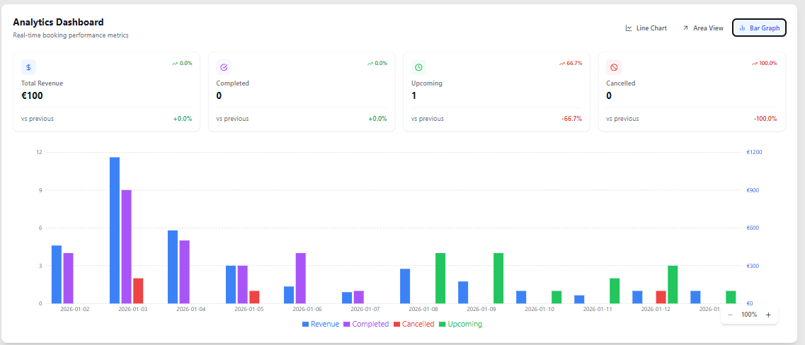
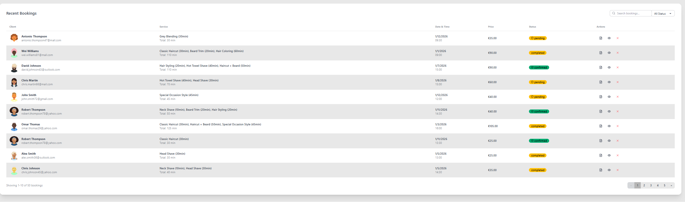
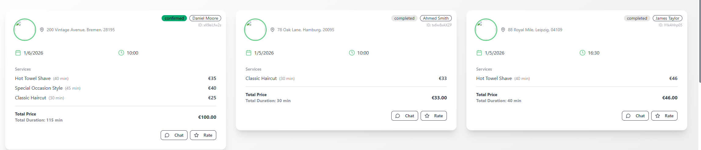
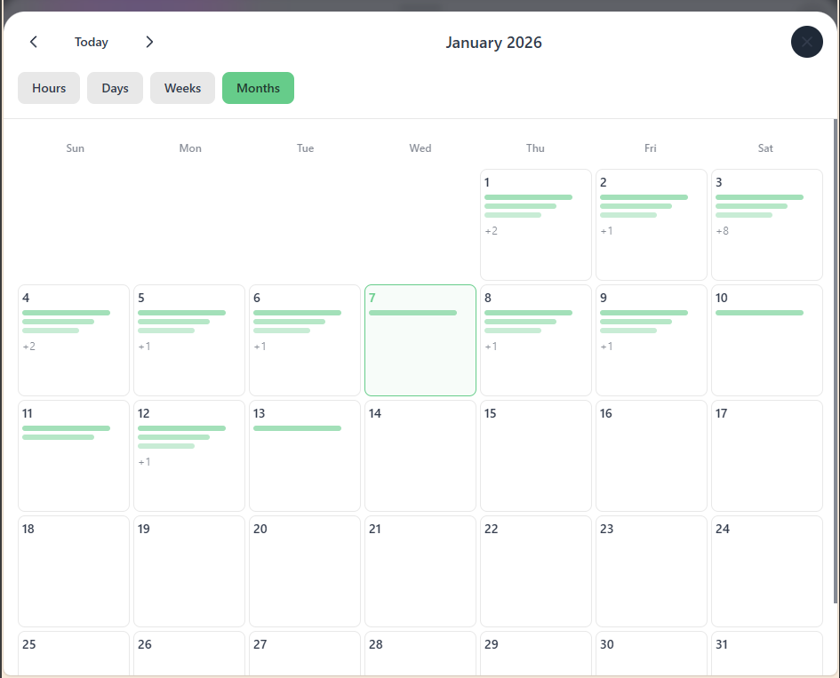
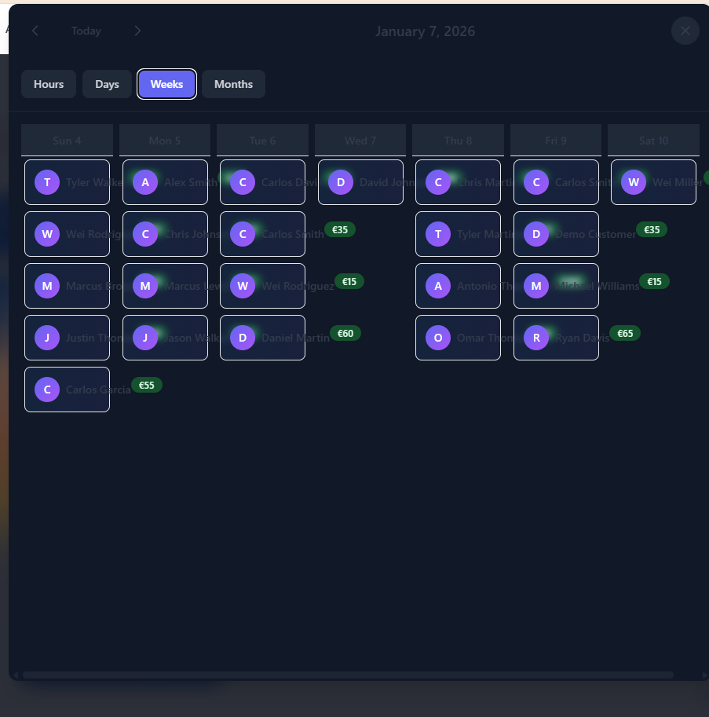
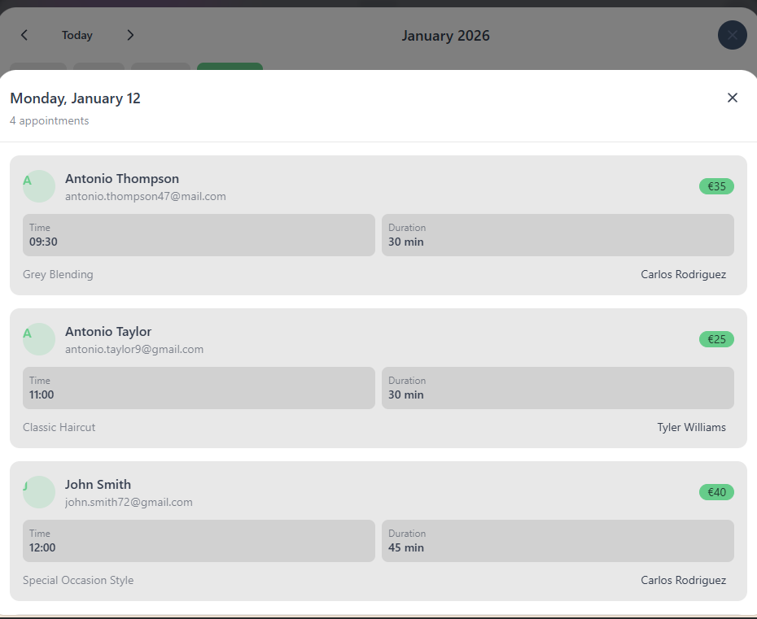
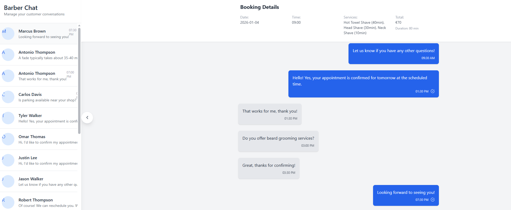
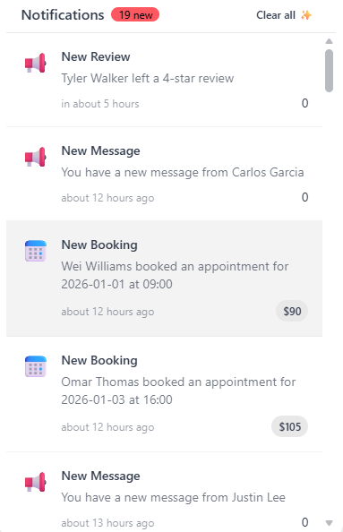
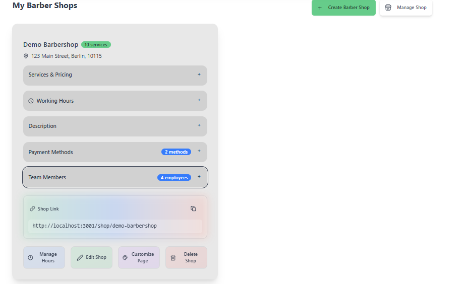
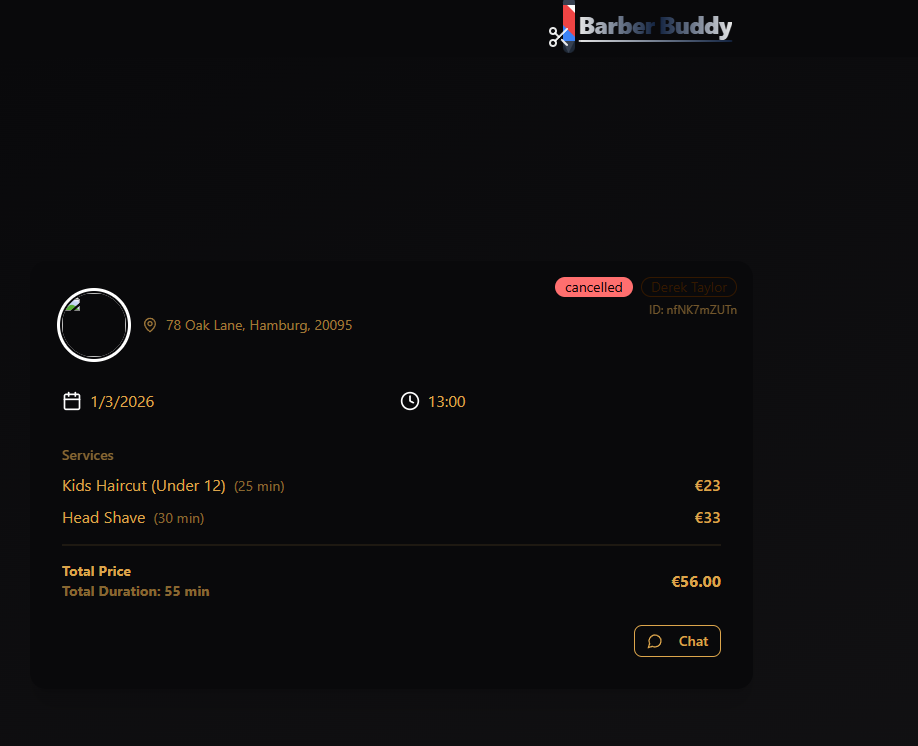

<div align="center">

# ✂️ BarbersBuddies

### The Complete Open-Source Booking Platform for Barbershops

**Launch your own professional barbershop booking system in minutes. Free, open-source, and packed with features.**

[](https://github.com/OthmanAdi/BarbersBuddies_Onlineshop_maker/releases)
[](https://reactjs.org/)
[](https://firebase.google.com/)
[](https://stripe.com/)
[](LICENSE)

[Live Demo](https://barbersbuddies.com) · [Report Bug](https://github.com/OthmanAdi/BarbersBuddies_Onlineshop_maker/issues) · [Request Feature](https://github.com/OthmanAdi/BarbersBuddies_Onlineshop_maker/issues)

</div>

---

## 📸 Screenshots

<div align="center">

### Shop Owner Dashboard

<p><i>Real-time analytics with revenue tracking, booking stats, and performance metrics</i></p>

### Booking Management
<table>
<tr>
<td align="center"><br/><b>Bookings Table</b></td>
</tr>
<tr>
<td align="center"><br/><b>Booking Cards View</b></td>
</tr>
</table>

### Calendar & Scheduling
<table>
<tr>
<td align="center"><br/><b>Month View</b></td>
<td align="center"><br/><b>Week View (Dark)</b></td>
</tr>
</table>


<p><i>Detailed day view with appointment breakdown</i></p>

### Messaging & Communication
<table>
<tr>
<td align="center"><br/><b>Customer Messaging</b></td>
</tr>
<tr>
<td align="center"><br/><b>Notifications Panel</b></td>
</tr>
</table>

### Shop Management

<p><i>Manage services, employees, hours, and shop settings</i></p>

### Dark Mode

<p><i>Full dark mode support across the entire platform</i></p>

</div>

---

## ⚡ Features

| Feature | Description |
|---------|-------------|
| 🗓️ **Smart Booking** | Real-time availability, service selection, employee assignment |
| 📊 **Analytics Dashboard** | Track revenue, bookings, and customer trends |
| 💳 **Stripe Payments** | Secure payment processing built-in |
| 🌍 **Multi-language** | English, German, Turkish, Arabic |
| 🎨 **Themes** | Light, dark, and luxury themes |
| 📱 **Mobile-first** | Fully responsive design |
| 🔔 **Notifications** | Email confirmations + in-app alerts |
| 👥 **Employee Management** | Staff schedules, assignments, permissions |
| ⭐ **Ratings & Reviews** | Customer feedback system |
| 💬 **Messaging** | Shop-to-customer communication |
| 📅 **Calendar Views** | Hours, days, weeks, months view |
| 🔐 **Demo Mode** | Built-in demo accounts for testing |

---

## 🏗️ Architecture

```
┌─────────────────────────────────────────────────────────────────┐
│                         Client (React)                          │
│  ┌──────────┐ ┌──────────┐ ┌──────────┐ ┌──────────────────┐   │
│  │ Booking  │ │Dashboard │ │  Shop    │ │   Auth & User    │   │
│  │   Flow   │ │ Analytics│ │ Landing  │ │   Management     │   │
│  └────┬─────┘ └────┬─────┘ └────┬─────┘ └────────┬─────────┘   │
└───────┼────────────┼────────────┼────────────────┼─────────────┘
        │            │            │                │
        ▼            ▼            ▼                ▼
┌─────────────────────────────────────────────────────────────────┐
│                      Firebase Services                          │
│  ┌──────────┐ ┌──────────┐ ┌──────────┐ ┌──────────────────┐   │
│  │Firestore │ │   Auth   │ │ Storage  │ │    Functions     │   │
│  │    DB    │ │          │ │ (Images) │ │  (Email/Stripe)  │   │
│  └──────────┘ └──────────┘ └──────────┘ └──────────────────┘   │
└─────────────────────────────────────────────────────────────────┘
        │                                          │
        ▼                                          ▼
   ┌─────────┐                              ┌─────────────┐
   │ Stripe  │                              │   Mailgun   │
   │Payments │                              │   (Email)   │
   └─────────┘                              └─────────────┘
```

---

## 🚀 Quick Start

### Prerequisites

- Node.js 22
- Java 21 or newer for the Firestore emulator
- No Firebase, Stripe, or Mailgun credentials are required for local demo access

### 1. Clone & Install

```bash
git clone https://github.com/OthmanAdi/BarbersBuddies_Onlineshop_maker.git
cd BarbersBuddies_Onlineshop_maker
npm install
npm --prefix functions install
```

### 2. Start the isolated Firebase services

```powershell
npm run emulators:start
```

This command is pinned to the disposable `demo-barbersbuddies` project and starts Auth, Firestore, Functions, and Storage. On Windows it also applies the short Java temporary path required by the emulator launcher.

### 3. Start the React app

Open a second PowerShell terminal:

```powershell
$env:PORT=3100
npm start
```

Open [http://localhost:3100/auth](http://localhost:3100/auth), then select **Enter professional demo**.

### Production configuration

Production requires a complete Firebase client configuration from `.env.example`. Partial configuration is rejected. Local persona access is unavailable in production and cannot be forced against live Firebase or a project ID without the `demo-` prefix.

## 🧪 Demo Mode

The local professional persona uses Firebase Anonymous Auth and creates only its own `users/{uid}` Firestore profile. It has no password or reusable credential. The persona registry and provisioning controller are modular so additional test roles can be added without weakening the environment boundary.

The panel is enabled only when all of these conditions are true:

- `NODE_ENV` is exactly `development`.
- Firebase is connected to local emulators.
- The Firebase project ID starts with `demo-`.
- `REACT_APP_DEMO_ACCESS` is not explicitly `false`.

Run the real emulator-backed contract check with:

```powershell
npm run test:demo-access:emulator
```

---

## 🛠️ Tech Stack

| Layer | Technology |
|-------|------------|
| Frontend | React 18, TailwindCSS, DaisyUI, Framer Motion |
| Backend | Firebase Functions (Node.js) |
| Database | Firestore |
| Auth | Firebase Authentication |
| Payments | Stripe |
| Email | Mailgun |
| Storage | Firebase Storage |
| Maps | Google Maps API |
| State | Zustand |
| Charts | Recharts, Tremor |

---

## 📁 Project Structure

```
BarbersBuddies/
├── src/
│   ├── components/     # React components
│   ├── Services/       # API services (Stripe, etc.)
│   ├── utils/          # Helpers (sanitize, logger)
│   ├── hooks/          # Custom React hooks
│   └── store.js        # Zustand state management
├── functions/          # Firebase Cloud Functions
├── scripts/
│   └── seed/           # Demo data seeding system
├── public/             # Static assets
└── docs/
    └── screenshots/    # App screenshots
```

---

## 🤝 Contributing

Contributions are welcome!

1. Fork the repo
2. Create your branch (`git checkout -b feature/awesome-feature`)
3. Commit changes (`git commit -m 'Add awesome feature'`)
4. Push (`git push origin feature/awesome-feature`)
5. Open a Pull Request

---

## 📄 License

MIT License - see [LICENSE](LICENSE) for details.

---

<div align="center">

**Built with ❤️ for the barbershop community**

[⬆ Back to top](#-barbersbuddies)

</div>
