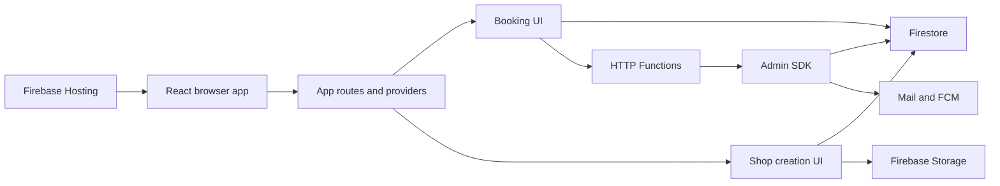

# BarbersBuddies system architecture

## Provenance

- **Observed:** This artifact studies the tracked source in `C:\Users\oasrvadmin\Documents\BarbersBuddies-revival-worktree` at Git revision `61132dc366e4e30edc9c8a69cde64b010cbb09c4` (branch `codex/barbersbuddies-revival` when inspected).
- **Observed:** The study is source-only and excludes `.env*`, service-account files, dependency directories, generated media, lockfile contents, and the tracked Firebase Hosting cache. No target code, dependencies, deployment, emulator, or external system was run.
- **Observed:** This artifact is intentionally pinned to the revision above. It does not establish the state of deployed Firebase, Stripe, mail, FCM, or Hosting resources.

## Executive summary

- **Observed:** The repository is a React single-page application with a Firebase Functions backend. The root package supplies React, Firebase browser SDK, Stripe browser SDK, React Router, and CRA scripts. `package.json:5-74`
- **Observed:** The browser application directly uses Firebase Auth, Firestore, Storage, Analytics, and Functions clients. `src/firebase.js:1-35`
- **Observed:** Firebase Hosting deploys the built SPA to two targets and routes all paths to `index.html`; the repository also deploys functions and Firestore rules/indexes. `firebase.json:2-103`
- **Observed:** Booking currently spans a client-side `bookedTimeSlots` reservation, an HTTP `createBooking` function that inserts a `bookings` document, and a client-side follow-up batch update. `src/components/BookNow.js:263-367`, `functions/index.js:39-119`
- **Inferred:** The duplicated reservation and booking stores, their differing status filters, and the lack of a transaction form the principal reliability boundary. Concurrent users can pass the client read-before-write check and create conflicting slot documents. `src/components/BookNow.js:263-297`, `functions/index.js:84-100`

## Architecture and boundaries

### Composition roots and dependency direction

- **Observed:** `src/index.js` creates the React root, enables `StrictMode`, wraps the app in React Buddy development support, and renders `App`. `src/index.js:1-18`
- **Observed:** `App` owns the language provider, router, Stripe Elements provider, shared navigation, offline indicator, Google redirect handling, email-action handling, and route table. `src/App.js:28-153`
- **Observed:** Public feature surfaces include shop discovery and booking; authenticated surfaces include customer appointments, shop messaging, shop creation, shop customisation, and client management. `src/App.js:122-144`
- **Observed:** `functions/index.js` initializes the Admin SDK and Mailgun client, then exports HTTP handlers, Firestore triggers, and a scheduled job. `functions/index.js:1-21`, `functions/index.js:39-121`, `functions/index.js:630-739`
- **Inferred:** UI feature modules depend directly on Firebase SDK functions and raw `fetch` calls rather than a shared browser domain/API boundary. Examples include booking, drafts, shop creation, messaging, and client management. `src/components/BookNow.js:1-16`, `src/components/useBarberShopPersistence.js:1-4`, `src/components/CreateBarberShop.js:28-60`

- **Observed:** The diagram reflects code-level calls only: booking reads/writes Firestore and calls an HTTP function; shop creation writes Firestore and uploads to Storage; functions use Admin SDK and messaging/mail integrations. `src/components/BookNow.js:66-83`, `src/components/BookNow.js:263-340`, `src/components/CreateBarberShop.js:1575-1647`, `functions/index.js:84-110`, `functions/index.js:923-961`

### Persistence and external-system boundaries

- **Observed:** Browser-local state includes the persisted Zustand `theme-storage` store and a localStorage draft key named `barbershop_draft`. `src/store.js:5-25`, `src/components/useBarberShopPersistence.js:6-7`, `src/components/useBarberShopPersistence.js:46-76`
- **Observed:** Firestore is used for user profiles, shops, bookings, slots, messages, ratings, notifications, shop-name records, temporary shops, and shop drafts. `src/firebase.js:85-122`, `src/components/BookNow.js:66-83`, `src/components/CreateBarberShop.js:1369-1377`, `scripts/seed/index.js:113-261`
- **Observed:** Service and shop images are uploaded from the browser to Firebase Storage. `src/components/CreateBarberShop.js:1575-1592`
- **Observed:** Server-side mail uses Mailgun configuration with environment/config fallbacks; a second tracked module configures Nodemailer from environment variables. `functions/index.js:12-21`, `functions/firebase-functions.js:7-13`
- **Observed:** The backend attempts FCM delivery after creating a shop message. `functions/index.js:923-943`
- **Unknown:** The active Firebase project, Function region/URL, deployed rules revision, Storage rules, Stripe backend/webhooks, and mail/FCM credentials were outside this source-only study.

## Happy, error, and edge paths

### Booking

- **Observed, happy path:** A shop landing page queries `barberShops` by `uniqueUrl` and links into `/book/:shopId`. `src/components/ShopLandingPage.js:102-120`, `src/components/ShopLandingPage.js:763-766`, `src/components/ShopLandingPage.js:1043-1046`
- **Observed, happy path:** `BookNow` reads the shop, derives available times from weekly availability, and subscribes to matching `bookedTimeSlots` documents for the selected date. `src/components/BookNow.js:63-84`, `src/components/BookNow.js:125-190`
- **Observed, happy path:** The UI validates customer data, queries for an occupied slot, creates a pending slot, calls `createBooking`, then marks the slot booked and updates employee information on the returned booking. `src/components/BookNow.js:218-367`
- **Observed, happy path:** `createBooking` validates selected request fields, writes a booking with the Admin SDK, sends two emails, then returns the generated ID. `functions/index.js:58-118`
- **Observed, error path:** If the function returns a non-success response or throws, the client deletes its pending slot reservation. `src/components/BookNow.js:407-427`
- **Observed, edge path:** Rescheduling performs a read-only occupied-slot check, directly updates the booking, creates a notification, then calls the reschedule HTTP function. `src/components/AppointmentRescheduleModal.js:173-277`
- **Observed, edge path:** The server reschedule handler separately queries bookings with statuses `confirmed` or `pending`, updates the booking to `rescheduled`, sends notification/email side effects, and returns success. `functions/index.js:570-623`

### Reliability and authorization failure modes

- **Observed:** The booking request URL in live code is single-quoted, so the environment expression is not interpolated. `src/components/BookNow.js:334`
- **Observed:** The client performs availability query and `addDoc` as two operations with a generated document ID and no `runTransaction`/deterministic resource key. `src/components/BookNow.js:263-297`
- **Inferred:** Two simultaneous booking attempts can both see an empty result and write different pending-slot documents. The source does not provide serializable mutual exclusion for that interval. `src/components/BookNow.js:263-297`
- **Observed:** The server `createBooking` handler writes a booking without checking an existing slot and does not include the client-side booking status, time-slot ID, employee, owner, or price fields in its inserted document. `functions/index.js:58-100`
- **Observed:** Client blocked-slot reads consider `booked` and `pending`, server rescheduling considers booking statuses `confirmed` and `pending`, and the booking helper also filters `confirmed` and `pending`. `src/components/BookNow.js:66-74`, `functions/index.js:570-580`, `src/utils/bookingFunctions.js:67-80`
- **Inferred:** Availability can disagree across booking, rescheduling, and calendar paths because they do not share a canonical status lifecycle or sole source of truth. `src/components/BookNow.js:66-74`, `src/components/BookNow.js:263-297`, `functions/index.js:570-593`
- **Observed:** Rules define no match for `bookedTimeSlots`, `tempShops`, `shopDrafts`, or `typing`; the final explicit rule match is `deletedAccounts`. `firestore.rules:5-65`
- **Inferred:** If the deployed rules match this tracked file, direct browser operations against those unmatched collections are denied by default. `firestore.rules:5-65`, `src/components/BookNow.js:66-83`, `src/components/CreateBarberShop.js:1369-1377`, `src/components/useBarberShopPersistence.js:69-104`
- **Observed:** `createBooking` applies CORS and request-body validation but does not verify a Firebase ID token or request ownership before using the Admin SDK. `functions/index.js:30-37`, `functions/index.js:39-100`
- **Observed:** Update, cancellation, rating-response, message, and FCM-token HTTP handlers also accept request fields without an observed identity-verification step. `functions/index.js:213-280`, `functions/index.js:283-328`, `functions/index.js:827-866`, `functions/index.js:869-972`, `functions/index.js:1025-1046`
- **Inferred:** These endpoints need server-enforced authorization before production use because CORS is not authorization and Admin SDK bypasses Firestore rules. `functions/index.js:30-37`, `functions/index.js:84-100`
- **Observed:** `BookNow` fetches the same shop in three effects, and its selected-employee filtering listener omits `selectedEmployee` from its dependency array. `src/components/BookNow.js:63-84`, `src/components/BookNow.js:125-169`, `src/components/BookNow.js:472-487`
- **Inferred:** The booking UI can issue redundant reads and retain a stale employee-specific slot listener until some other dependency changes. `src/components/BookNow.js:63-84`
- **Observed:** The code mixes date-only strings, `Date` construction, localized weekday calculations, and `toISOString()` for booking/calendar decisions. `src/components/BookNow.js:171-190`, `src/components/DateTimeSelectionStep.js:59-105`, `functions/index.js:655-670`
- **Inferred:** A canonical timestamp plus explicit shop IANA timezone is required before correctness across timezone and DST boundaries can be claimed. `src/components/BookNow.js:171-190`, `functions/index.js:655-670`

## Interfaces, data, and configuration

### Data contracts observed in code

- **Observed:** A published shop includes identity, owner, availability, employees, services, URL, image URLs, theme, and content-block configuration. `src/components/CreateBarberShop.js:1596-1647`
- **Observed:** Client booking input includes shop/customer/date/services/time, optional employee fields, a pending status, a client slot ID, and a client-generated ISO creation time. `src/components/BookNow.js:313-329`
- **Observed:** The server-created booking persists only shop/customer/date/services/time and server timestamp from the destructured request fields. `functions/index.js:58-100`
- **Observed:** Shop-name projection is maintained by Firestore on-create, on-delete, and name-change triggers. `functions/triggers.js:4-33`
- **Observed:** Firestore rules allow public reads for shops and ratings, authenticated booking creation, participant-limited booking reads/writes, and a read-only client view of `shopNames`. `firestore.rules:11-27`, `firestore.rules:37-59`
- **Inferred:** Booking document fields and rules are not fully aligned, since rule authorization references `shopOwnerId` while the observed server insert does not create it. `firestore.rules:19-27`, `functions/index.js:84-100`

### Configuration

- **Observed:** Browser Firebase initialization reads `REACT_APP_FIREBASE_*` environment keys and creates Analytics, Auth, Firestore, Storage, and Functions clients. `src/firebase.js:20-35`
- **Observed:** Stripe browser initialization reads `REACT_APP_STRIPE_PUBLISHABLE_KEY`. `src/App.js:28`, `src/Services/stripe.js:5-48`
- **Observed:** Function mail configuration reads Firebase Functions config and environment fallbacks, without embedding a credential value in this artifact. `functions/index.js:12-21`
- **Observed:** Hosting applies an SPA rewrite and broad CSP/CORS-related headers to both targets. `firebase.json:4-47`, `firebase.json:50-94`
- **Inferred:** The broad Hosting headers conflict with the narrower per-function CORS allowlist and should be redesigned with explicit required origins and resource sources. `firebase.json:9-31`, `functions/index.js:23-37`

## Decisions, constraints, and extension guide

- **Observed:** Current persistence deliberately keeps shop-creation drafts locally first, then debounces Firestore writes, and flushes the debounce on unmount when marked dirty. `src/components/useBarberShopPersistence.js:92-164`
- **Observed:** Current shop-name uniqueness relies on a post-write trigger projection, while the creator writes `barberShops` directly. `functions/triggers.js:4-33`, `src/components/CreateBarberShop.js:1596-1647`
- **Inferred:** Shop name/slug reservation should become a backend transaction or callable command rather than an eventual trigger projection if uniqueness is a product invariant. `functions/triggers.js:4-33`, `src/components/CreateBarberShop.js:1596-1647`
- **Inferred:** Booking should be redesigned around one server-authoritative command that validates authenticated actor policy, canonicalizes time, calculates service duration, reserves a deterministic slot inside a Firestore transaction, creates/updates the booking, and emits idempotent notification work. `src/components/BookNow.js:263-367`, `functions/index.js:84-110`, `functions/index.js:570-623`
- **Inferred:** The browser should consume a narrow API/availability interface and stop directly mutating reservation records. This reduces rule coupling and eliminates the current client/server split-brain. `src/components/BookNow.js:263-367`, `firestore.rules:5-65`
- **Observed:** Current tests consist of a default CRA text assertion and Jest DOM setup; no booking, rule, function, race, calendar, or integration test was found in the tracked test entry points inspected. `src/App.test.js:1-8`, `src/setupTests.js:1-5`
- **Inferred:** The first test investment should be emulator-backed function/rule tests and deterministic time/race tests, followed by one browser-level booking happy path and failure-recovery test. `src/App.test.js:1-8`, `functions/index.js:39-119`, `firestore.rules:1-67`
- **Observed:** Seed tooling requires a service-account file, creates demo identities/data, and its clean path deletes collections and users. `scripts/seed/index.js:33-49`, `scripts/seed/index.js:291-338`
- **Inferred:** Seed and clean commands must remain opt-in, credential-gated, and isolated to a non-production project. The study did not run them. `scripts/seed/index.js:12-18`, `scripts/seed/index.js:291-338`
- **Observed:** A tracked seed configuration includes demo credentials. Their values are intentionally omitted here. `scripts/seed/config.js:7-20`
- **Inferred:** Move demo credentials into safe test fixtures or a nontracked local configuration, and rotate them if they were ever used outside disposable development data. `scripts/seed/config.js:7-20`

## Unresolved questions

- **Unknown:** Which Firebase project, Hosting target, Functions region, and rules/indexes revision are currently deployed?
- **Unknown:** Is unauthenticated booking intended, and if so, what anti-abuse, payment, confirmation, cancellation, and rate-limit policy applies?
- **Unknown:** Is capacity per shop, employee, chair, or service duration, and can services overlap or require buffers?
- **Unknown:** Which timezone is authoritative for each shop, and what outcomes are expected around DST transitions?
- **Unknown:** Is `bookedTimeSlots` a current production collection, a compatibility layer, or a partial migration from querying `bookings`?
- **Unknown:** What backend/webhook owns Stripe subscription truth, given client calls to `/create-subscription` and a placeholder backend URL? `src/components/SubscriptionPage.js:40`, `src/components/SubscriptionForm.js:44`
- **Unknown:** Do deployed Storage rules, FCM settings, and mail provider configuration permit the intended browser and backend behaviors?

## Evidence index

- **Observed:** Browser composition and routes: `src/index.js:1-18`, `src/App.js:106-153`.
- **Observed:** Firebase browser boundary: `src/firebase.js:20-35`; local persistence: `src/store.js:5-25`, `src/components/useBarberShopPersistence.js:46-164`.
- **Observed:** Booking UI and reservation behavior: `src/components/BookNow.js:63-84`, `src/components/BookNow.js:218-427`.
- **Observed:** Calendar/reschedule behavior: `src/components/DateTimeSelectionStep.js:59-105`, `src/components/AppointmentRescheduleModal.js:173-277`.
- **Observed:** Functions and side effects: `functions/index.js:23-119`, `functions/index.js:570-739`, `functions/index.js:827-1046`; shop-name triggers: `functions/triggers.js:4-33`.
- **Observed:** Security/deployment configuration: `firestore.rules:1-67`, `firebase.json:2-103`, `functions/package.json:1-23`.
- **Observed:** Shop/draft/seed schema evidence: `src/components/CreateBarberShop.js:1369-1377`, `src/components/CreateBarberShop.js:1575-1647`, `scripts/seed/index.js:113-261`.
- **Observed:** Test baseline: `src/App.test.js:1-8`, `src/setupTests.js:1-5`.
