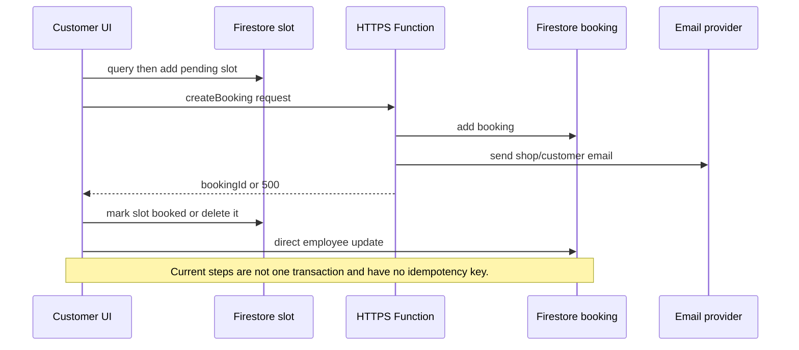

# Booking concurrency and lifecycle map

**Repository:** `BarbersBuddies-revival-worktree`

**Revision studied:** `61132dc366e4e30edc9c8a69cde64b010cbb09c4`

**Scope:** booking creation, confirmation/status, cancellation, rescheduling, calendar views, Firebase boundaries, rules, and concurrency.

**Method:** static, read-only source study. No target code, Firebase emulator, deployed Function, production data, secret file, or network endpoint was executed/read.
**Confidence:** high for source-level behavior; unknown for the deployed revision and live data.

## Executive summary

- **Observed:** Booking mutations are split between React direct Firestore writes and public HTTPS Functions. There is no single authoritative command path. [src/components/BookNow.js:263-367](../../src/components/BookNow.js#L263), [functions/index.js:39-119](../../functions/index.js#L39)
- **Observed:** The active create flow has a literal, non-interpolated Function URL, and it directly writes `bookedTimeSlots`, for which the checked-in rules define no match. [src/components/BookNow.js:334](../../src/components/BookNow.js#L334), [firestore.rules:18-65](../../firestore.rules#L18)
- **Inferred:** With the checked-in rules deployed, client-side slot reads and writes are denied. With the URL corrected, concurrent requests can still create overlaps because neither create path uses a transaction, a deterministic slot key, or an idempotency key.
- **Observed:** The reschedule modal references an undeclared `appointment`; its caller does not pass that prop. [src/components/AppointmentRescheduleModal.js:10](../../src/components/AppointmentRescheduleModal.js#L10), [src/components/AppointmentRescheduleModal.js:59](../../src/components/AppointmentRescheduleModal.js#L59), [src/components/AppointmentCard.js:1014-1020](../../src/components/AppointmentCard.js#L1014)
- **Observed:** The only tracked application test is the default React smoke test, so booking and Rules behavior lack source-level test coverage. [src/App.test.js:1-8](../../src/App.test.js#L1)

## Current interfaces and data model

### Firebase composition

- **Observed:** The React client initializes Firebase Auth, Firestore, Storage, and Functions in one composition module. [src/firebase.js:1-38](../../src/firebase.js#L1)
- **Observed:** Hosting deploys the `functions` directory and Firestore Rules/indexes from the named root files. [firebase.json:52-58](../../firebase.json#L52)
- **Observed:** The booking route is public in React routing, while only shop messaging is wrapped in `ProtectedRoute`. [src/App.js:123-143](../../src/App.js#L123)

### Booking shape in use

| Field/group | Evidence | Finding |
|---|---|---|
| Core booking fields | [functions/index.js:87-98](../../functions/index.js#L87) | **Observed:** create Function persists shop/customer identifiers, date, services, time, and server timestamp. |
| Client-only intended fields | [src/components/BookNow.js:313-329](../../src/components/BookNow.js#L313) | **Observed:** client also constructs `status`, `timeSlotId`, price, and employee fields, but Function destructures/persists only a subset. |
| Slot record | [src/components/BookNow.js:288-297](../../src/components/BookNow.js#L288) | **Observed:** slots use random document IDs and include shop/date/time/status plus optional employee. |
| Rule fields | [firestore.rules:18-27](../../firestore.rules#L18) | **Observed:** booking Rules expect `userEmail` or `shopOwnerId`; server create does not write `shopOwnerId`. |
| Status values | [src/components/BookNow.js:293-324](../../src/components/BookNow.js#L293), [functions/index.js:576-593](../../functions/index.js#L576) | **Observed:** code uses `pending`, `booked`, `confirmed`, `cancelled`, `completed`, `rejected`, and `rescheduled`, with no centralized state machine. |

### Rule compatibility

- **Observed:** `bookings` allows client creation for any authenticated user and client update/delete when token email matches `resource.data.userEmail` or UID matches `resource.data.shopOwnerId`. [firestore.rules:18-27](../../firestore.rules#L18)
- **Observed:** `notifications` requires `resource.data.userId` to equal the caller UID. [firestore.rules:44-48](../../firestore.rules#L44)
- **Observed:** no match exists for `bookedTimeSlots`, `typing`, or `shopDrafts` in the checked-in Rules. [firestore.rules:1-67](../../firestore.rules#L1)
- **Inferred:** direct slot mutations are denied; several client notification writes are also denied because create/reschedule payloads omit `userId` or place an email in it. [src/components/BookNow.js:375-392](../../src/components/BookNow.js#L375), [src/components/AppointmentRescheduleModal.js:237-250](../../src/components/AppointmentRescheduleModal.js#L237)
- **Unknown:** whether a later deployed Rules revision differs from this source revision.

## Behavioral paths

### Create booking

1. **Observed:** customer navigates to `/book/:shopId`; `BookNow` reads shop data, builds local time slots from schedule, and subscribes to blocked slots. [src/App.js:129](../../src/App.js#L129), [src/components/BookNow.js:63-83](../../src/components/BookNow.js#L63), [src/components/BookNow.js:171-203](../../src/components/BookNow.js#L171)
2. **Observed:** final submit validates fields/phone, then queries `bookedTimeSlots` for shop/date/time and separately adds a `pending` random-ID slot document. [src/components/BookNow.js:218-310](../../src/components/BookNow.js#L218)
3. **Observed:** client constructs a richer booking payload but calls a single-quoted literal URL. [src/components/BookNow.js:313-340](../../src/components/BookNow.js#L313)
4. **Observed:** intended Function validates basic request fields, creates a booking document, sends two emails, and returns `bookingId`; it neither authenticates the caller nor checks availability. [functions/index.js:39-119](../../functions/index.js#L39)
5. **Observed:** on successful response, client batch-updates slot and booking employee fields, then separately writes a notification; on response error/catch it deletes the slot. [src/components/BookNow.js:344-426](../../src/components/BookNow.js#L344)

**Happy path status:** **Unknown.** Static evidence indicates the literal endpoint URL and Rules incompatibility prevent the intended happy path under the checked-in configuration.

**Error and edge behavior:**

- **Observed:** slot availability is a read followed by a separate add, with no transaction. [src/components/BookNow.js:263-297](../../src/components/BookNow.js#L263)
- **Inferred duplicate race:** two simultaneous requests can both observe an empty query and create different random slot documents. The Function independently adds bookings without any conflict check. [functions/index.js:84-98](../../functions/index.js#L84)
- **Observed:** Function writes booking before email; any email failure becomes HTTP 500 after persistence. [functions/index.js:87-118](../../functions/index.js#L87)
- **Inferred partial-write retry:** client deletes only its slot on error and has no booking ID/idempotency key to reconcile the already-created booking; a retry can create another booking. [src/components/BookNow.js:417-424](../../src/components/BookNow.js#L417)

### Confirm/status changes

- **Observed:** `BookingConfirmation` directly reads/updates booking status to `confirmed`, then separately writes notification and optional message. [src/components/BookingConfirmation.js:19-121](../../src/components/BookingConfirmation.js#L19)
- **Inferred:** this component is presently unreferenced by a source import/caller search, but it remains a competing mutation implementation.
- **Observed:** Shop Calendar directly changes status to confirmed, cancelled, or completed, with no slot, notification, or email mutation in that method. [src/components/ShopCalendarTab.js:83-105](../../src/components/ShopCalendarTab.js#L83), [src/components/ShopCalendarTab.js:245-283](../../src/components/ShopCalendarTab.js#L245)

### Cancel booking

1. **Observed:** customer card queries its old slot and marks the first matching slot `cancelled` before calling the cancellation Function. [src/components/AppointmentCard.js:183-243](../../src/components/AppointmentCard.js#L183)
2. **Observed:** it then creates a notification and directly marks the booking cancelled. [src/components/AppointmentCard.js:245-301](../../src/components/AppointmentCard.js#L245)
3. **Observed:** Function separately loads the booking, changes status, sends emails, and returns 500 on any subsequent error. [functions/index.js:283-327](../../functions/index.js#L283)
4. **Observed:** shop dashboard implements the same client-first slot cancellation and does not check `response.ok`. [src/components/ClientManagementDashboard.js:390-429](../../src/components/ClientManagementDashboard.js#L390)

**Inferred edge failures:** a failed client slot update stops cancellation before server command; a Function email failure can report failure after booking status changed; a Function-only cancel never frees the slot because Function code never updates `bookedTimeSlots`.

### Reschedule booking

1. **Observed:** opening the modal passes only `appointmentId`, `shopId`, callbacks, and open state. [src/components/AppointmentCard.js:1004-1020](../../src/components/AppointmentCard.js#L1004)
2. **Observed:** modal references undeclared `appointment.id`; it therefore has no valid current-appointment exclusion. [src/components/AppointmentRescheduleModal.js:57-64](../../src/components/AppointmentRescheduleModal.js#L57), [src/components/AppointmentRescheduleModal.js:94-97](../../src/components/AppointmentRescheduleModal.js#L94)
3. **Observed:** intended modal query only checks `booked` slot state, directly updates booking to `rescheduled`, creates notification, then calls HTTPS Function. [src/components/AppointmentRescheduleModal.js:173-271](../../src/components/AppointmentRescheduleModal.js#L173)
4. **Observed:** modal calls parent callback, which reaches `MyAppointments` and invokes the same HTTPS Function a second time. [src/components/AppointmentRescheduleModal.js:273-277](../../src/components/AppointmentRescheduleModal.js#L273), [src/components/AppointmentCard.js:559-577](../../src/components/AppointmentCard.js#L559), [src/components/MyAppointments.js:137-165](../../src/components/MyAppointments.js#L137)
5. **Observed:** Function checks only `confirmed`/`pending`, writes `rescheduled`, creates notification, and sends emails. [functions/index.js:560-626](../../functions/index.js#L560)

**Inferred edge failures:** after the modal crash is repaired, rescheduling can double-send mutations/notifications; no code moves the old slot or reserves the new one; a later conflict check ignores `rescheduled` bookings.

### Calendar and timing

- **Observed:** Shop Calendar queries `shopId`, a selected-date range, and orders by selected date/time. [src/components/ShopCalendarTab.js:49-64](../../src/components/ShopCalendarTab.js#L49)
- **Observed:** committed index config contains only a `shopNames` index. [firestore.indexes.json:1-16](../../firestore.indexes.json#L1)
- **Inferred:** calendar query likely requires a composite index and can fail until it is deployed.
- **Observed:** reschedule converts a local selected date using `toISOString()`, while its availability fetch constructs date strings from local fields. [src/components/AppointmentRescheduleModal.js:41-43](../../src/components/AppointmentRescheduleModal.js#L41), [src/components/AppointmentRescheduleModal.js:173-175](../../src/components/AppointmentRescheduleModal.js#L173)
- **Inferred:** positive UTC-offset users can see an off-by-one date during reschedule; calendar uses the same UTC conversion pattern. [src/components/ShopCalendarTab.js:50-51](../../src/components/ShopCalendarTab.js#L50), [src/components/ShopCalendarTab.js:156-163](../../src/components/ShopCalendarTab.js#L156)

## Target invariants and extension guide

### Required invariants

1. One authoritative server command owns every create, reschedule, cancel, confirm, and complete transition.
2. Every active booking maps to exactly one deterministic resource-slot document; a cancelled booking maps to none.
3. A transaction validates resource, local date/time, working hours, employee, service duration, status transition, and slot vacancy before it writes booking and slot together.
4. Client retries reuse a caller-provided idempotency key and return the original command result.
5. Notification/email delivery is an outbox concern, not a condition that makes an already-committed booking command ambiguous.
6. Date-only values remain `YYYY-MM-DD` domain strings; instant/time-zone conversion occurs only at an explicit display boundary.
7. Authorization derives from verified Auth identity and authoritative owner/customer IDs, never request-body email or a CORS origin.

### Safe extension sequence

1. Add a dedicated booking-domain Function/service and emulator tests before changing UI callers.
2. Define canonical booking, slot, command, status-transition, and error contracts.
3. Implement a transaction with deterministic slot IDs and idempotency records.
4. Reconcile existing booking/slot documents through an explicit, dry-run-capable migration plan; do not delete conflicting historical data automatically.
5. Switch one UI path at a time to the command client and remove duplicate direct writes.
6. Deploy Rules/indexes with emulator tests and run controlled concurrency probes before enabling public booking traffic.

## Unresolved questions

- **Unknown:** Which Firebase project, Functions region/base URL, Rules revision, and indexes are deployed now?
- **Unknown:** Which historical booking fields/statuses and slot records exist, and how many are orphaned or overlapping?
- **Unknown:** Is a booking permitted to be unauthenticated, employee-specific, multi-resource, or duration-overlapping rather than fixed-slot?
- **Unknown:** Which email delivery guarantee is product-required: best effort, at-least-once outbox, or explicit customer confirmation?
- **Unknown:** Whether deployment uses a newer server source than this pinned checkout.

## Evidence index

| Concern | Primary evidence |
|---|---|
| React/Firebase boundary | [src/firebase.js:1-38](../../src/firebase.js#L1) |
| Public booking route | [src/App.js:123-143](../../src/App.js#L123) |
| Create flow | [src/components/BookNow.js:218-426](../../src/components/BookNow.js#L218) |
| Customer cancel/reschedule | [src/components/AppointmentCard.js:183-313](../../src/components/AppointmentCard.js#L183), [src/components/AppointmentRescheduleModal.js:173-320](../../src/components/AppointmentRescheduleModal.js#L173) |
| Shop edit/cancel/calendar | [src/components/ClientManagementDashboard.js:242-300](../../src/components/ClientManagementDashboard.js#L242), [src/components/ClientManagementDashboard.js:362-450](../../src/components/ClientManagementDashboard.js#L362), [src/components/ShopCalendarTab.js:53-105](../../src/components/ShopCalendarTab.js#L53) |
| HTTPS handlers | [functions/index.js:23-119](../../functions/index.js#L23), [functions/index.js:213-327](../../functions/index.js#L213), [functions/index.js:533-628](../../functions/index.js#L533) |
| Rules/indexes | [firestore.rules:18-65](../../firestore.rules#L18), [firestore.indexes.json:1-16](../../firestore.indexes.json#L1) |
| Tests | [src/App.test.js:1-8](../../src/App.test.js#L1) |
